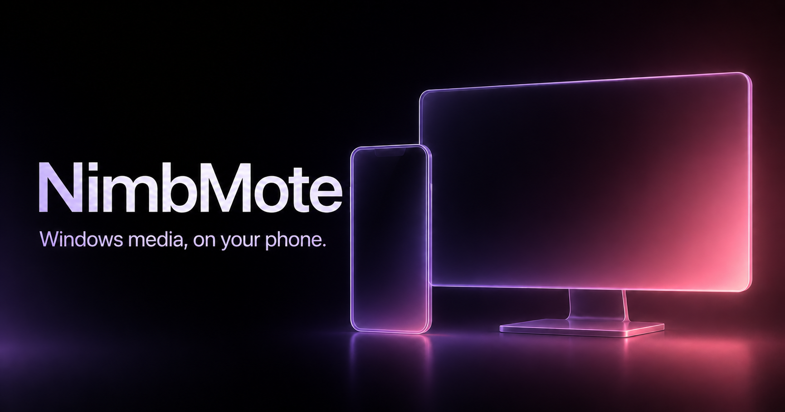

# NimbMote

**A private Android remote for Windows media, volume, and power controls on your local Wi-Fi.**

[Website](https://nimbmote.pinkelectric.workers.dev) · [Privacy](https://nimbmote.pinkelectric.workers.dev/privacy) · [Releases](releases/)



NimbMote pairs one Android phone with one Windows computer. Once paired, the phone can control the active Windows media session, adjust Windows volume, show the current Windows wallpaper, and send sleep, lock, shutdown, or restart commands. It does not require an account, a cloud relay, analytics, or a browser extension.

> **Public test release.** NimbMote is currently distributed as a Windows setup file and an Android test APK. The Android package is not yet in Google Play, so Android will ask for approval before installing it.

## What it does

- Play, pause, skip, seek, and view artwork from the active Windows media session.
- Adjust or mute the Windows master volume from Android.
- Keep a one-tap Play/Pause control in Android Quick Settings.
- Show the selected Windows wallpaper and connection state in the phone app.
- Send explicit sleep, lock, shutdown, and restart commands.
- Pair with a one-time six-digit code while both devices are on the same Wi-Fi.

The phone mirrors the Windows media session; it does not stream or play a second audio feed.

## Get the current test release

The current version is **v0.10.1**.

1. Download and install [NimbMote Agent for Windows](releases/v0.10.1/NimbMote-Setup-v0.10.1.exe).
2. Download [NimbMote for Android](releases/v0.10.1/NimbMote-v0.10.1-debug.apk) and open the APK on your phone.
3. Open NimbMote Agent. On a first installation it displays a six-digit pairing code.
4. Open NimbMote on Android, enter the code, and tap **Search and pair on this LAN**.

The Windows installer normally preserves a pairing when updating. During uninstall it offers a choice: remove the application only, or also remove saved pairing data for a completely fresh installation.

## Requirements

- Windows 10 or Windows 11, x64.
- Android 8.0 or newer.
- Both devices connected to the same local Wi-Fi or a phone hotspot.

For reliable background media controls on Samsung / One UI, set NimbMote's battery use to **Unrestricted** and do not add it to Deep sleeping apps.

## Privacy and local-network design

NimbMote has no user account and no product cloud service. Pairing secrets stay in Android Keystore on the phone and Windows DPAPI on the PC. Subsequent local connections are authenticated with HMAC and a timestamp/nonce; the wallpaper preview is separately encrypted with AES-256-GCM.

The current local transport is authenticated but not a general encrypted tunnel: media metadata and commands can be visible to someone who controls the same local network. Pair only on a network you trust.

## Repository layout

```text
android/    Kotlin, Jetpack Compose, Media3 Android client
windows/    .NET 8 WinForms Windows tray agent and installer
protocol/   Protocol description, schema, and fixtures
releases/   Versioned installable test builds and changelogs
docs/       Architecture and release documentation
```

## Build from source

The source tree contains portable build tooling for local development. The authoritative product version is the root [`VERSION`](VERSION) file; Android and Windows derive their release version from it.

```powershell
# Windows agent
dotnet build .\windows\BentleyRemote.sln -c Release

# Android test APK
cd .\android
.\gradlew.bat :app:assembleDebug
```

See [AGENTS.md](AGENTS.md) for repository and release rules, and [TESTING.md](TESTING.md) for hardware checks.

## Current public identity and compatibility

The public product is **NimbMote**. Some implementation identifiers still use the former `BentleyRemote` / `Deskora` names so that v0.9.0 can update existing installations without forcing people to reinstall or pair devices again. Those identifiers are intentionally being changed only in a dedicated compatibility release before Google Play distribution.

## Built with Codex

NimbMote was developed iteratively with OpenAI Codex as the coding agent. Codex helped turn user-led hardware testing into changes across the Android client, Windows agent, local protocol, automated tests, installers, release artifacts, and documentation. NimbMote itself has no runtime dependency on an OpenAI model or API.

## License

[MIT](LICENSE) © 2026 Pink Electric.
