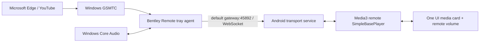

# Architecture

## Main path

## Desktop preview v0.3

При foreground Android Activity посылает один authenticated request. Windows agent
снимает primary interactive display, уменьшает JPEG и посылает только в уже
paired active socket. Preview шифруется AES-GCM отдельным HKDF-derived key;
никакой image не пишется на диск, не отправляется в cloud и не захватывается
в фоне. Compose держит лишь последний decoded preview до следующего foreground
request или ручного Refresh.

The phone is both hotspot gateway and Android endpoint. Discovery therefore
does not use multicast, mDNS, SSID assumptions, or a hardcoded subnet. Windows
enumerates live default gateways, prioritizes Wi-Fi, and retries them.

## Reverse path

After initial pairing, Android may instead initiate a WebSocket to the explicit
Windows hotspot-interface IPv4 on port 45893. Windows uses `HttpListener`; its
URL ACL and Private-profile firewall rule are opt-in because they mutate system
network policy and normally require elevation.

## Process boundaries

Android `BentleyRemoteService` owns the WebSocket transport, `RemotePlayer` and
Media3 `MediaSession`. Compose only observes a process-wide `StateFlow`, so
closing the Activity does not tear down the session. `RemotePlayer` advertises
`PLAYBACK_TYPE_REMOTE`, volume 0..100 and supported Player commands. Its
handlers emit protocol commands; it never owns a decoder/audio sink.

Windows `AgentCoordinator` joins three adapters:

- `WindowsMediaSessionService`: polls current GSMTC once per second and performs
  transport/seek methods;
- `WindowsVolumeService`: reads/writes the default Multimedia render endpoint;
- `ConnectionHub`: discovery, two WebSocket directions, pairing, HMAC,
  heartbeat and reconnect.

Polling is deliberate for MVP: it naturally recovers from Edge process/session
replacement and default audio endpoint switches without retaining stale WinRT
or COM event sources.

## Security boundaries

Before pairing, Android accepts only `pair.request` with the current code. After
pairing, it accepts only the stored Windows `clientId` with a valid time-bound
HMAC. The reverse listener similarly accepts only the stored Android
`serverId`. Commands/states before authentication close the socket.

Secrets are 256 random bits. Android encrypts the secret with an AES/GCM key
inside Android Keystore. Windows protects it with DPAPI CurrentUser. Replay
nonces are remembered for five minutes. The wire is not encrypted in v1; use a
private hotspot and see `protocol/README.md` for the threat-model limitation.
